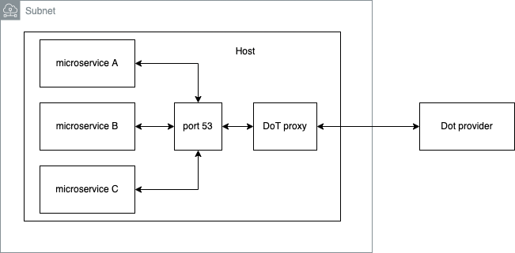
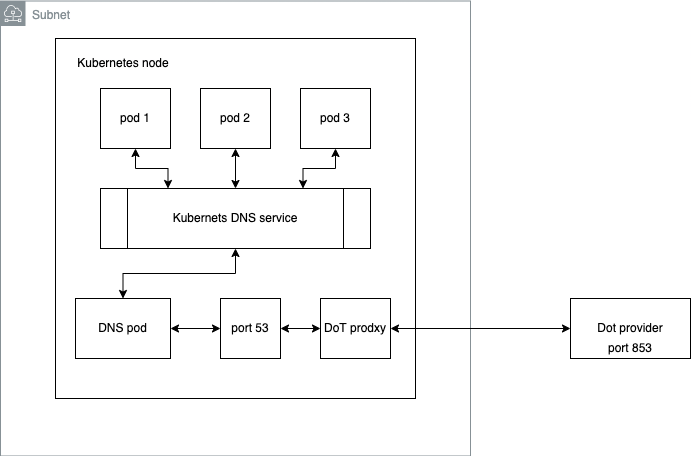

# DNS over TLS proxy



## usage with docker

The proxy server runs over a hardened image provided by Google, the distroless image offer a secure runtime without any king of package managers, shells or any other programs.

### build
```sh
 docker build -t dot .
```

### run
```sh
 docker run -itp 53:53 -p 53:53/UDP dot
```

### if you want to try another DoT provider
```sh
docker run -itp 53:53 -p 53:53/UDP --env DOT_SERVER=8.8.8.8 dot
```

## implementation

This project was built in a modular structure to be easily expandable or modifiable in the future.

 - The service is writhe in python and use only the standard library
 - This proxy works over TCP and UDP protocols
 - Also supports multiple clients connections at the same time
 - The server works by default with cloudfare any other DoT provider can be configured setting the environment variable DOT_SERVER


### Security

 - The proxy can be suffered from external attacks like eavesdropping and spoofing?, isn't likely because the communication is over TLS
 - Is possible that a malicious agent inject code or modify the proxy?, Is not possible because of the runtime, a distroless image mitigate this problem.

### Implementing in a microservice architecture

For apply this proxy server in a microservice architecture, I will use kubernetes as environment for this example.

This proxy can be deployed in Kuberntes as daemonset that means Kubernetes will create at least one pod in every node,
and for receive all the node traffic in the port 53 the hostNetwork flag wil be set on true.

In the diagram bellow is an example of how the DoT proxy take all the traffic of the port 53 in the cluster with no other configuration needed in the microservices.



An example of the daemontset is locate in the kubernetes folder.

### Improvements

- Gracefully stop for the handlers
- Adding a caching layer for improve performance
- Private DNS zones can be affected causing errors

## Testing

```sh
$ dig @localhost n26.com
```

example output
```sh
$ dig @localhost n26.com

; <<>> DiG 9.10.6 <<>> @localhost n26.com
; (2 servers found)
;; global options: +cmd
;; Got answer:
;; ->>HEADER<<- opcode: QUERY, status: NOERROR, id: 10939
;; flags: qr rd ra; QUERY: 1, ANSWER: 3, AUTHORITY: 0, ADDITIONAL: 1

;; OPT PSEUDOSECTION:
; EDNS: version: 0, flags:; udp: 1232
; PAD: 00 00 00 00 00 00 00 00 00 00 00 00 00 00 00 00 00 00 00 00 00 00 00 00 00 00 00 00 00 00 00 00 00 00 00 00 00 00 00 00 00 00 00 00 00 00 00 00 00 00 00 00 00 00 00 00 00 00 00 00 00 00 00 00 00 00 00 00 00 00 00 00 00 00 00 00 00 00 00 00 00 00 00 00 00 00 00 00 00 00 00 00 00 00 00 00 00 00 00 00 00 00 00 00 00 00 00 00 00 00 00 00 00 00 00 00 00 00 00 00 00 00 00 00 00 00 00 00 00 00 00 00 00 00 00 00 00 00 00 00 00 00 00 00 00 00 00 00 00 00 00 00 00 00 00 00 00 00 00 00 00 00 00 00 00 00 00 00 00 00 00 00 00 00 00 00 00 00 00 00 00 00 00 00 00 00 00 00 00 00 00 00 00 00 00 00 00 00 00 00 00 00 00 00 00 00 00 00 00 00 00 00 00 00 00 00 00 00 00 00 00 00 00 00 00 00 00 00 00 00 00 00 00 00 00 00 00 00 00 00 00 00 00 00 00 00 00 00 00 00 00 00 00 00 00 00 00 00 00 00 00 00 00 00 00 00 00 00 00 00 00 00 00 00 00 00 00 00 00 00 00 00 00 00 00 00 00 00 00 00 00 00 00 00 00 00 00 00 00 00 00 00 00 00 00 00 00 00 00 00 00 00 00 00 00 00 00 00 00 00 00 00 00 00 00 00 00 00 00 00 00 00 00 00 00 00 00 00 00 00 00 00 00 00 00 00 00 00 00 00 00 00 00 00 00 00 00 00 00 00 00 00 00 00 00 00 00 00 00 00 00 00 00 00 00 00 00 00 00 00 ("............................................................................................................................................................................................................................................................................................................................................................................................")
;; QUESTION SECTION:
;n26.com.                       IN      A

;; ANSWER SECTION:
n26.com.                60      IN      A       54.70.125.43
n26.com.                60      IN      A       44.242.108.79
n26.com.                60      IN      A       18.236.31.56

;; Query time: 249 msec
;; SERVER: 127.0.0.1#53(127.0.0.1)
;; WHEN: Fri Dec 03 17:16:22 CST 2021
;; MSG SIZE  rcvd: 468
```

